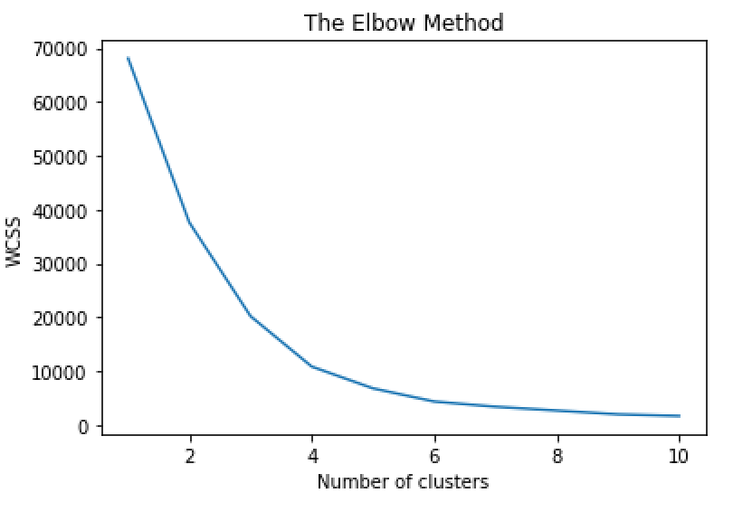

# SEO - Kmeans clustering 

In this project I will show step by step how to use Google search Console data and Kmeans clustering to group your URLs depending on a specific KPI. With this you will be able to see some important insights and optimize better your site. It will also give you an overview of the site from a more analitical stand point and will help you to make data driven decisions.

## Getting Started

These instructions will get you a copy of the project up and running on your local machine for development and testing purposes. See deployment for notes on how to deploy the project on a live system.

### Prerequisites

To be able to use this you will need the following Prerequisites

```
Python3
Google search console Access
Screaming Frog

```

## Building your Data Set

### Getting the Data from GSC

The first step we need is to get access to [Google Search Console](https://search.google.com/search-console) for your own site.
Once in the console we need to go to Performance and export page a report that includes the following.


| URL | Clicks	| Impressions |CTR	| Position| 
| ----| ------- | ------------| ----| --------|

You can select the time frame that you want and add the necessary filterst that you think they are right for your project.
If you want to get more data(more thn 1,000 URLs) You can try using the Google Search Console APi to make bigger requests.

### Getting Title and description Lenghts

Once we have the list URLs, we go to screaming frog and in mode we select list and drop our list manually.

Here we would only need to export the title lengths and the description lengths. Once we get the length we can do a Vlookup and add it to our Google Search Console export we did before, the spreadsheet shoudl look like this:

| URL | Title Length | Description Length | Clicks	| Impressions |CTR	| Position| 
| ----| ------------ |------------------- | --------| ------------| ----|-------- |

### Cleaning the data with Excel

Since im lazy, I will use excell to clean some stuff on the data set. The only important thing that we need to remove is the % sign on CTRs. Make sure that all the numbers are real numbers.

### Installing Python Libraries

now that we have our dataset ready, we need to install some libraries that we will be suing for this.
To install the libraries copy the following and run it in the terminal

```
pip install pandas
pip install numpy
pip install sklearn
pip install matplotlib
```

## Running the script

### Opening The Data Set

The first two steps that we have on the script is opening the script. We need to make sure we are in the folder that our xlsx file is(The dataset we just created from GSC and Screaming frog). Once there open our file

```python
#Opening xlsx
df = pd.read_excel (r'www.uselessthingstobuy.com.xlsx')

```
### Selecting the columns

After opening the file we need to decide what kind of experiment we will be doing. In this case I want to see what Title length vs CTR. This way I will be able to see what is the optimal title length based on the amount of clicks im getting. 

For this we create a new Dataframe that contains the two columns we just mentioned. Title Lenght and CTR.

```python
#### CTR Vs Title Length ####
X2 = pd.DataFrame(df, columns = ['Title Length','CTR'])

```

### Finding the right number of clusters for Kmeans


Kmeans basically clusters your data in different groups. To know what is the optimal amount of clusters we need to have we run the elbow method. This will tell us based on our data what is the optimal number of clusters we should use for our data. Make sure that you are using the name that your dataframe has in our case its X2.

```python

wcss = []
for i in range(1, 11):
    kmeans = KMeans(n_clusters = i, init = 'k-means++', random_state = 42)
    kmeans.fit(X2)
    wcss.append(kmeans.inertia_)
plt.plot(range(1, 11), wcss)
plt.title('The Elbow Method')
plt.xlabel('Number of clusters')
plt.ylabel('WCSS')
plt.show()

```

The result should look something like this



We can see that the optimal number of cluster is where the elbow is bending so in this case it will be 3

### Kmeans

After we perform the kmean clustering with the number of clusters we got from our elbow method.

```python
kmeans = KMeans(n_clusters=3).fit(X4)
centroids = kmeans.cluster_centers_
print(centroids)
```

### Plotting

Now that we have run everything we want to see our results and how our data is clustered. To plot our results we run the follwoing

```python
plt.title('Impressions vs CTR for UTB')
plt.scatter(df['Impressions'], df['CTR'], c= kmeans.labels_.astype(float), s=50, alpha=0.5,label = 'URLs')
plt.scatter(centroids[:, 0], centroids[:, 1], c='red', s=50,label='Centroid')
plt.ylabel('CTR')
plt.xlabel('Impressions')
plt.legend()
```


### Insights

My data is very Shitty but we can still see that based on our graph the optimal title lenght that has high CTR are between 35 - 55 characters.


### Example 2 CTR v Impressions


This example can show us how well are our pages performing in General. High impressions low CTR will means we need to do something about those pages because we are ranking well we are having impressions but users are not clicking on our results. Why? maybe bad Call to Action or something different. This could help seeing if we have a problem like that.

Also in this example, we need to remove outliers. Since my data had one big outlier that had over 87K impressions I just removed it from the spreadsheet to di this graph.


